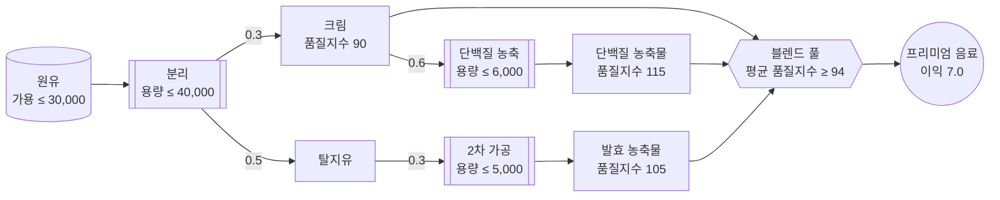
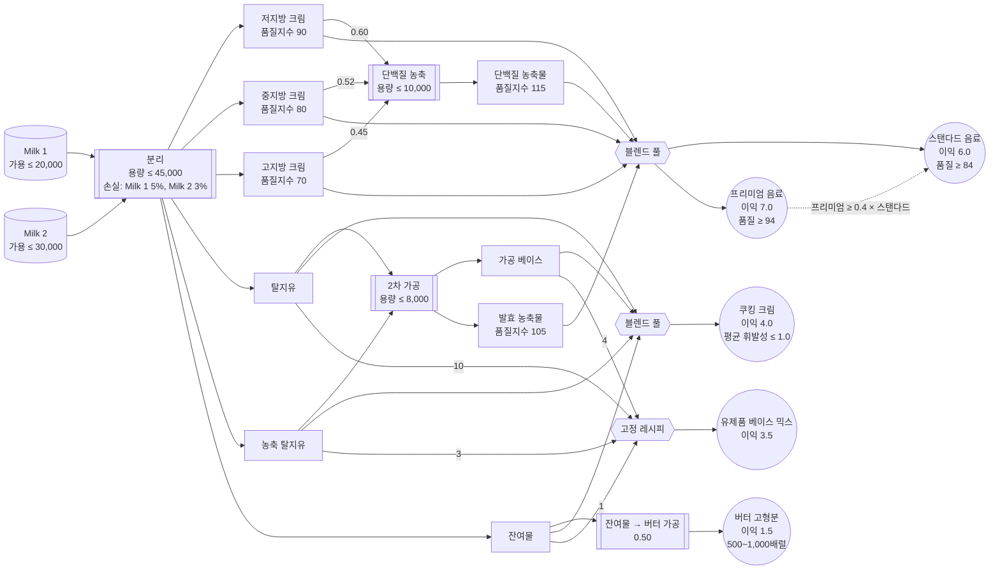

# 4. Gurobi Modeler로 최적화 모델 만들기

지금까지(0~3번 노트북)는 문제를 직접 수식으로 세우고 `gurobipy` 코드를 한 줄씩 작성했습니다.
이번 실습부터는 **Gurobi Intelligence Hub**의 AI 에이전트를 사용해 자연어로 문제를 설명하고,
모델 스펙 작성부터 `gurobipy` 구현, 테스트 작성까지 에이전트가 만들어주는 과정을 경험합니다.

> ⚠️ 이 문서에는 실행할 코드가 없습니다. 실제 모델링 작업은 웹 브라우저에서
> **[intelligence.gurobi.com](https://intelligence.gurobi.com)** 에 접속해 진행합니다.
> 이 문서는 실습에 필요한 문제 설명, 진행 가이드, 그리고 참고할 수 있는 예상 결과를 제공합니다.

---

## Intelligence Hub란?

Gurobi Intelligence Hub는 Gurobi의 AI 에이전트를 한 곳에서 사용할 수 있는 웹 서비스입니다.

| 에이전트 | 상태 | 역할 |
|---|---|---|
| **Gurobot** | GA | Gurobi 제품/문법/라이선스 전반에 대한 상시 지원 전문가 |
| **Modeler** | Beta | 비즈니스 문제 설명 → 검증된 `gurobipy` 코드로 안내 |
| **Explainer** | Experimental | 이미 만들어진 모델 인스턴스를 진단·해석 (다음 문서에서 사용) |

모든 답변은 Gurobi의 공식 문서·예제·모범 사례에 기반하며, 채팅/파일은 세션별로 격리되어 처리됩니다.

## Modeler란?

**Modeler**는 사용자를 문제 설명에서부터 검증된, 실행 가능한 `gurobipy` 코드까지 점진적으로 안내하는
모델링 어시스턴트입니다.

- **대화형 스펙 작성**: 목적함수, 제약, 입력/출력, 테스트 시나리오를 한 번에 하나씩 질문하며 구체화합니다.
- **비즈니스 중심 워크플로**: 사용자가 수식이 아니라 실제 문제에 계속 집중하도록 안내합니다.
- **Acceptance Test 기반 검증**: 스펙을 바탕으로 pytest 테스트 시나리오를 생성하고, 직접 실행해서
  통과/실패를 확인한 뒤 필요하면 스스로 수정합니다.
- **반복 가능한 설계**: 문제가 바뀌면 스펙을 업데이트하고, AI가 모델과 테스트에 변경 사항을 반영합니다.

> 💡 **주의**: Modeler는 "정확한(correct)" 모델을 만들도록 도와주지만, "가장 효율적인(performant)"
> 모델을 보장하지는 않습니다. AI가 생성한 모델을 무조건 신뢰하지 말고, 이 문서의 워밍업처럼
> 작은 acceptance test로 직접 검증하는 습관을 들이세요.

## 실습 목표

이번 실습은 세 부분으로 구성됩니다.

- **Part 0. 워밍업**: 이미 정답을 알고 있는 초급 문제를 Modeler에게 맡겨보면서, AI가 만든 모델을
  어떻게 신뢰·검증하는지 체감합니다.
- **Part 1. 본 실습**: 유가공(乳加工) 공장에서 프리미엄 유제품 음료 하나를 생산하는 단순화된
  문제를 Modeler에게 설명하여, **총 이익을 최대화하는 생산 계획 모델**을 만들고 **feasible한
  (실행 가능한) 최적해**를 얻습니다. 30분 안에 끝낼 수 있는 분량입니다.
- **부록. 전체 공정 모델**: 같은 공장을 훨씬 더 현실적으로 확장한 버전입니다. 시간이 남거나 더
  도전해보고 싶다면 시도해보세요 — 다음 실습(`5_Explainer`)은 이 부록의 모델을 그대로 사용합니다.

## Part 0. 워밍업 — 이미 답을 아는 문제로 Modeler 검증하기

본격적으로 새로운 문제를 다루기 전에, 여러분이 이미 손으로 직접 코딩해서 **정답을 알고 있는 문제**를
Modeler에게 그대로 맡겨보고 결과를 비교해봅니다. Modeler 소개에서 강조했듯, AI가 만든 모델을
신뢰하려면 이미 답을 아는 작은 문제로 직접 검증해보는 습관이 중요합니다.

**사용할 문제**: 초급 [`3_생산재고관리문제_답안.ipynb`](../초급/3_생산재고관리문제_답안.ipynb)의 다기간 생산·재고 관리 문제

월별 수요·생산 단가·재고 유지비·생산 능력 데이터는 `중급/3_생산재고관리문제_data.csv`
(month, demand, production_cost, holding_cost, production_capacity 열)로 별도 제공됩니다.

### Modeler 프롬프트 예시

Intelligence Hub 채팅창에 아래 프롬프트를 그대로 붙여넣고, `3_생산재고관리문제_data.csv`
파일을 함께 첨부하세요. (막히면 펼쳐보되, 먼저 스스로 문제를 설명해보길 권합니다.)

펼쳐서 프롬프트 보기

> 우리 공장의 12개월 생산·재고 계획을 최적화하고 싶어.
>
> 한 가지 제품을 매달 생산해서 재고로 쌓아두고, 그 재고로 그달 수요를 맞추고 있어.
>
> 매달 생산할 수 있는 최대 수량(생산 능력)이 정해져 있어서 그 이상은 생산 못 해. 제품을 하나
> 생산할 때마다 드는 생산 비용이랑, 안 팔리고 재고로 남은 제품에 매달 드는 재고 유지비가
> 있는데, 둘 다 월별로 금액이 달라.
>
> 재고는 지난달에서 그대로 이월된 뒤, 이번 달 생산한 만큼 늘고 이번 달 수요만큼 팔려서 줄어드는
> 식으로 매달 이어져. 첫 달은 재고가 하나도 없는 상태에서 시작하고, 재고가 마이너스가 되면 안 돼.
>
> 월별 수요, 생산 단가, 재고 유지비, 생산 능력은 첨부한 CSV 파일
> (`3_생산재고관리문제_data.csv`)에 정리해 뒀어.
>
> 12개월 전체 기간의 생산 비용과 재고 유지비를 합친 총 비용을 최소화하는 월별 생산 계획을
> 세워 줘.

### 진행 방법

1. 위 프롬프트를 Intelligence Hub의 **Modeler**에 전달하고, `3_생산재고관리문제_data.csv`
   파일을 함께 첨부합니다.
2. Modeler가 명세를 구체화하기 위해 던지는 질문(예: 생산량을 정수로 볼지 연속값으로 볼지,
   기말 재고 조건, 수요를 못 맞췄을 때 처리 방식 등)에 하나씩 답합니다.
3. 명세가 완성되면 "**수리모형부터 보여줘**"처럼 요청해서 Modeler가 세운 집합·변수·목적함수·
   제약을 확인하고, 우리가 말로 설명한 내용과 맞는지 살펴봅니다.
4. 이어서 "**gurobipy로 구현하고, 첨부한 CSV 데이터로 최적화해줘**"라고 요청해 코드를 생성·
   실행받습니다.
5. 나온 **총 비용(목적함수 값)**과 월별 생산량·재고량이 [초급 노트북](../초급/3_생산재고관리문제_답안.ipynb)에서 이미 확인한 답과 일치하는지
   비교합니다.
6. 만약 다르다면 무엇이, 왜 다른지(생산량을 정수/연속 중 무엇으로 처리했는지, 재고 균형식의 초기
   재고 처리 등) Modeler와의 대화를 통해 찾아내고 수정을 요청해보세요.

### 워밍업 예상 결과

| 항목 | 초급 답안 (직접 코딩) | Modeler 결과 |
|---|---|---|
| 목적함수 값 (총 비용, 최소화) | 4,250.00 | **4,250.00** (일치해야 함) |
| 1월 생산량 / 재고량 | 40 / 0 | 40 / 0 |
| 7월 생산량 / 재고량 | 100 / 10 | 100 / 10 |
| 일치 여부 | - | ✅ 일치 |

## Part 1. 본 실습 — 프리미엄 유제품 음료 생산 계획

워밍업에서 Modeler를 사용하는 방법을 익혔다면, 이번에는 **정답을 모르는 새로운 문제**를
Modeler와 함께 처음부터 모델링해봅니다. (이 공장의 훨씬 더 현실적인 버전은 문서 맨 뒤 부록에
있습니다 — 이번 Part 1은 30분 안에 끝낼 수 있도록 단순화한 버전입니다.)

### 비즈니스 문제 설명

한 유가공 공장이 원유를 사서 **프리미엄 유제품 음료** 하나를 만듭니다.

원유는 분리 설비를 거치면 크림과 탈지유로 나뉩니다. 크림은 그대로 음료에 섞어도 되고,
**단백질 농축 설비**를 거치면 더 고품질인 단백질 농축물로 바뀝니다. 탈지유는 그 자체로는
음료에 쓸 수 없고, **2차 가공 설비**를 거쳐야 발효 농축물이 되어 음료 재료로 쓰입니다.

음료는 이 세 가지(크림·단백질 농축물·발효 농축물)를 부피 기준으로 블렌딩해서 만드는데, 평균
품질지수가 **94 이상**이어야 판매할 수 있습니다. (품질지수는 실제 성분표가 아니라, 부피 기준으로
섞으면 그대로 평균이 나는 점수입니다 — 예를 들어 품질지수 90짜리와 115짜리를 절반씩 섞으면
정확히 102.5가 됩니다.)

| 스트림 | 수율 (배럴/배럴) | 품질지수 |
|---|---|---|
| 크림 (원유 분리 직후) | 0.3 (원유 기준) | 90 |
| 탈지유 (원유 분리 직후) | 0.5 (원유 기준) | 직접 사용 불가 |
| 단백질 농축물 | 0.6 (크림 기준) | 115 |
| 발효 농축물 | 0.3 (탈지유 기준) | 105 |

| 설비 / 자원 | 하루 처리 한도 |
|---|---|
| 원유 구매 | 30,000배럴 |
| 분리 설비 | 40,000배럴 |
| 단백질 농축 설비 | 6,000배럴 |
| 2차 가공 설비 | 5,000배럴 |

음료는 배럴당 **7.0(백 달러)**의 이익을 냅니다.

아래 다이어그램은 원유가 분리·가공을 거쳐 프리미엄 음료가 되기까지의 흐름을 보여줍니다. 화살표
옆의 숫자는 배럴당 수율, 점선은 최종 제품이 만족해야 하는 제약입니다.

**목표**: 하루 이익을 최대화하는 생산 계획을 세우세요.

### 진행 방법

Modeler는 문제 설명을 한 번에 다 받지 않고, **한 번에 하나씩 질문하며** 스펙을 구체화하는
방식으로 동작합니다.

1. 그래서 문제를 한 번에 다 설명하지 말고 짧게 시작해서, Modeler가 순서대로 묻는 질문
   (공정/수율, 배합 방식, 조달 방식, 비용, 용량 제약, 판매 조건 등)에 하나씩 답합니다.
   (대화가 실제로 어떻게 흘러가는지는 아래 "Modeler 프롬프트 예시"를 참고하세요.)
2. 명세가 완성되면 "**수리모형부터 보여줘**"처럼 요청해서 Modeler가 세운 집합·변수·목적함수·
   제약을 확인하고, 우리가 말로 설명한 내용과 맞는지 살펴봅니다.
3. 이어서 "**gurobipy로 구현하고 최적화까지 실행해줘**"라고 요청해 코드를 생성·실행받습니다.
4. 나온 **총 이익(목적함수 값)**과 각 설비 사용량이 아래 "Part 1 예상 결과"와 일치하는지
   비교합니다.
5. 만약 다르다면 무엇이, 왜 다른지(물질 균형 제약의 부등호 방향, 품질 제약의 부등호 방향,
   설비 용량 제약 등) Modeler와의 대화를 통해 찾아내고 수정을 요청해보세요. (아래 "Modeler
   프롬프트 예시" 마지막 부분에 실제로 이런 상황을 겪은 사례가 있습니다.)

### Part 1 예상 결과

Modeler가 생성한 모델을 실행한 결과입니다. (이익 단위: 백 달러 = USD 100)

| 항목 | 값 |
|---|---|
| Optimization Status | OPTIMAL |
| 총 이익 (목적함수 값) | **70,210.84** |
| 원유 사용량 (≤ 30,000) | 30,000.00 (상한 도달) |
| 단백질 농축 설비 사용량 (≤ 6,000) | 약 1,174.70 (여유 있음) |
| 2차 가공 설비 사용량 (≤ 5,000) | 5,000.00 (상한 도달) |

| 스트림 | 생산량 (배럴) |
|---|---|
| 크림 (직접 블렌딩) | 약 7,825.30 |
| 단백질 농축물 | 약 704.82 |
| 발효 농축물 | 1,500.00 |
| **프리미엄 유제품 음료 (총 생산량)** | 약 10,030.12 |

> ※ 실제 Modeler가 생성하는 변수명·구현 방식은 위와 다를 수 있지만, 스펙에 이 문서의 문제
> 설명이 빠짐없이 반영되었다면 최적값은 위와 동일해야 합니다. 값이 다르다면 스펙이나 구현에
> 누락된 제약이 없는지 다시 확인하세요.

### Modeler 프롬프트 예시

위 "진행 방법"대로 진행하되, 실제로 대화가 어떤 식으로 오가는지 감이 안 잡히면 아래 예시를
펼쳐보세요. (막히면 펼쳐보되, 먼저 스스로 대화를 이끌어보길 권합니다.)

펼쳐서 대화 예시 보기

> **나**: 우리 유가공 공장의 하루 생산 계획을 최적화하고 싶어. 원유를 사서 프리미엄 유제품
> 음료 하나를 만드는 문제야. 도와줄 수 있어?

Modeler는 바로 스펙을 짜지 않고, 목적함수부터 확인하는 객관식 질문을 던집니다 (예: "비용
최소화 / 수익 최대화 / 이익 최대화 / 생산량 최대화 중 어디에 가깝나요?").

> **나**: 이익 최대화야. 공정을 설명할게: 원유를 분리 설비에 넣으면 크림이랑 탈지유가 나와.
> 원유 1배럴당 크림 0.3배럴, 탈지유 0.5배럴이 나오고 나머지는 공정 손실이야.

Modeler: "음료의 배합(레시피)은 어떻게 되나요? 고정 비율 혼합인가요, 아니면 품질 기준만
만족하면 되는 유연한 혼합인가요?"

> **나**: 크림·단백질 농축물·발효 농축물 세 가지를 부피 기준으로 자유롭게 섞어서 만드는데,
> 평균 품질지수가 94 이상이어야 팔 수 있어. 크림은 그 자체로 품질지수 90이고, 크림을 단백질
> 농축 설비에 넣으면 품질지수 115짜리 단백질 농축물로 바뀌는데 크림 1배럴당 0.6배럴이 나와.

Modeler: "발효 농축물은 어떻게 만들어지나요? 외부 구매인가요, 아니면 탈지유를 가공해서
만드나요? 품질지수도 알려주세요."

> **나**: 탈지유는 그 자체로는 음료에 못 쓰고, 2차 가공 설비를 거쳐야 품질지수 105짜리 발효
> 농축물이 되고, 이게 음료 재료로 쓰여. 탈지유 1배럴을 넣으면 발효 농축물 0.3배럴이 나와.

Modeler는 이어서 비용·가격 구조를 묻습니다.

> **나**: 따로 원가 항목은 없고, 음료는 배럴당 7.0(백 달러)의 순이익을 낸다고만 알고 있어.
> 즉 음료 생산량 × 7.0을 최대화하면 돼.

Modeler: "하루에 구매 가능한 원유 양이나 설비 처리 용량에 제한이 있나요?"

> **나**: 둘 다 있어. 원유는 하루 최대 30,000배럴까지 살 수 있고, 분리 설비는 하루
> 40,000배럴까지 처리할 수 있어. 단백질 농축 설비는 하루 6,000배럴, 2차 가공 설비는 하루
> 5,000배럴까지만 처리할 수 있어.

Modeler는 이어서 "생산된 음료를 전량 판매할 수 있나요?", "블렌딩 비율에 추가 제약이 있나요?"
처럼 한두 번 더 세부 사항을 확인합니다 — 이 문제에서는 "전량 판매 가능하고, 비율 제약 없이
품질지수 94만 만족하면 돼"처럼 짧게 답하면 됩니다.

명세가 다 채워졌다 싶으면, 코드부터 요청하지 말고 수리모형을 먼저 확인합니다.

> **나**: 좋아, 구현하기 전에 수리모형부터 보여줘 (집합, 변수, 목적함수, 제약).

Modeler는 아래와 같이 완성된 수리모형을 정리해서 보여줍니다. 우리가 말로 설명한 내용과
빠짐없이 맞는지 하나씩 대조해봅니다.

**결정 변수 (7개)**

| 변수 | 의미 |
|---|---|
| $x$ | 하루 원유 구매량 (배럴) |
| $c_b$ | 블렌딩에 직접 투입되는 크림 |
| $c_p$ | 단백질 농축 설비에 투입되는 크림 |
| $p$ | 생산된 단백질 농축물 |
| $s$ | 발효 설비에 투입되는 탈지유 |
| $f$ | 생산된 발효 농축물 |
| $b$ | 생산된 프리미엄 음료 |

**목적함수**

$$\max \quad 7.0 \cdot b$$

**제약 조건**

$$x \leq 30{,}000 \quad \text{(C1: 원유 구매 상한)}$$
$$x \leq 40{,}000 \quad \text{(C2: 분리 설비 용량 — C1에 의해 사실상 비구속)}$$
$$c_p \leq 6{,}000 \quad \text{(C3: 단백질 농축 설비 용량)}$$
$$s \leq 5{,}000 \quad \text{(C4: 발효 설비 용량)}$$
$$c_b + c_p = 0.3x \quad \text{(C5: 크림 물질 균형)}$$
$$s = 0.5x \quad \text{(C6: 탈지유 물질 균형)}$$
$$p = 0.6 \cdot c_p \quad \text{(C7: 단백질 농축물 균형)}$$
$$f = 0.3 \cdot s \quad \text{(C8: 발효 농축물 균형)}$$
$$b = c_b + p + f \quad \text{(C9: 음료 생산량 균형)}$$
$$-4 \cdot c_b + 21 \cdot p + 11 \cdot f \geq 0 \quad \text{(C10: 품질 요건 } \tfrac{90c_b+115p+105f}{b}\geq 94 \text{ 를 선형화)}$$
$$x, c_b, c_p, p, s, f, b \geq 0 \quad \text{(C11: 비음 조건)}$$

수리모형이 말로 설명한 내용과 맞다고 확인되면 구현을 요청합니다.

> **나**: 수리모형 맞아. gurobipy로 구현하고 최적화까지 실행해줘.

Modeler가 코드를 실행한 결과: 이익 31,500(백 달러), 프리미엄 음료 4,500배럴, 원유 구매량
10,000배럴(상한 30,000의 1/3만 사용), 2차 가공 설비는 5,000배럴로 풀가동.

> **나**: 잠깐, 원유 구매량이 상한(30,000배럴)에 도달을 안 했네? 탈지유를 2차 가공 설비
> 용량만큼만 가공하고 나머지는 그냥 버리면 되는 거 아니야? 꼭 탈지유를 100% 다 가공해야
> 하는 건 아니잖아.

Modeler가 다시 살펴보니, 위 수리모형의 **C5·C6가 부등식이 아니라 등식**(`c_b + c_p = 0.3x`,
`s = 0.5x`)으로 세워져 있었습니다. 즉 "분리된 크림·탈지유는 반드시 다 써야 한다"는 제약이
스펙에 암묵적으로 들어가 있었던 것입니다. 나머지 제약(C1~C4, C7~C11)은 그대로 두고, C5·C6만
아래처럼 등식(`=`)에서 부등식(`≤`, 즉 "생산량만큼 쓸 수 있지만 다 쓸 필요는 없다")으로
고칩니다.

$$c_b + c_p \leq 0.3x \quad \text{(C5 수정: 크림 물질 균형 — 남는 크림은 버릴 수 있음)}$$
$$s \leq 0.5x \quad \text{(C6 수정: 탈지유 물질 균형 — 남는 탈지유는 버릴 수 있음)}$$

이렇게 고쳐서 다시 최적화한 새 결과: 이익 70,210.84, 프리미엄 음료 10,030배럴, 원유 구매량
30,000배럴(상한 도달).

> ※ 실제 대화에서 Modeler가 묻는 순서나 정확한 문구는 위 예시와 다를 수 있습니다. 중요한 건
> "목적함수 → 공정/수율 → 품질 제약 → 용량 제약 → 판매 조건" 순으로 정보를 채워나가는 흐름이지,
> 질문의 정확한 표현이 아닙니다. 다만 위 대화 마지막 부분(원유가 상한에 도달 안 한 문제)은
> 실제로 이 문서를 준비하며 겪은 사례를 그대로 옮긴 것입니다 — Modeler가 만든 모델을 그대로
> 믿지 말고, 이렇게 설비별 사용량이 이상하게 낮은 곳은 없는지 직접 확인하는 습관이 중요합니다.

---

## 부록. 유가공 공장 전체 공정 모델

Part 1은 이 공장을 아주 단순화한 버전이었습니다. 실제로는 원유가 **두 종류**이고, 크림도
**저지방·중지방·고지방 3단계**로 나뉘며, 최종 제품도 **다섯 가지**(스탠다드/프리미엄 음료,
쿠킹 크림, 유제품 베이스 믹스, 버터 고형분)나 됩니다. 아래는 그 전체 버전입니다.

> 📌 다음 실습(`5_Explainer`)은 **이 부록의 모델을 그대로 사용합니다.** 시간이 남거나 더
> 도전해보고 싶다면 Modeler로 직접 만들어보세요. 그렇지 않더라도 아래 문제 설명은 다음
> 실습을 이해하는 배경 지식이 되니 한 번 읽어보길 권합니다.

### 비즈니스 문제 설명

한 유가공업체가 서로 다른 공급업체로부터 **두 종류의 원유**(Milk 1, Milk 2)를 구매합니다.
두 원유는 성분이 약간 다르며, 다음 **4단계 공정**을 거쳐 가공됩니다.

1. 분리 (Separation)
2. 단백질 농축 (Protein Concentration)
3. 2차 가공 (Secondary Processing)
4. 제품 블렌딩 (Product Blending)

최종적으로는 마진이 서로 다른 **소비자용 유제품과 원료**가 생산되어 판매됩니다.

> 💡 아래 내용을 이해하는 데 필요한 핵심 개념 하나만 먼저 짚고 갑니다. 뒤에 나오는 **품질지수**는
> 지방·단백질 함량 같은 실제 성분표가 아니라, **부피 기준으로 섞으면 그대로 평균이 나는 추상적인
> 점수**입니다(예: 품질지수 90짜리와 70짜리를 절반씩 섞으면 정확히 80이 됩니다). 최종 음용
> 유제품은 이 지수가 일정 기준(84 또는 94) 이상이어야 판매할 수 있는데, 원유를 분리해서 얻는
> 크림 자체의 지수는 70~90에 그칩니다. 그래서 2·3단계처럼 별도 설비로 크림·탈지유를 추가
> 가공해서 지수 105~115의 더 고품질 원료로 바꾸는 공정이 필요합니다 — 다만 이 가공 설비들은
> 하루 처리 용량이 정해져 있어서, "얼마나 가공해서 품질을 끌어올릴지"가 이 문제 전체의 핵심
> 트레이드오프입니다.

아래 다이어그램은 원유 두 종류가 분리·가공을 거쳐 다섯 가지 최종 제품으로 이어지는 전체 흐름을
한눈에 보여줍니다. 스트림 옆의 숫자는 배럴당 수율이고, 각 최종 제품이 만족해야 하는 제약은 노드
안에 함께 표시했습니다(점선은 프리미엄·스탠다드 음료 사이의 비율 제약처럼 서로 다른 두 제품에
걸친 제약입니다).

#### 1단계: 분리

원유는 원심분리와 여과를 통해 **6가지 성분**으로 분리됩니다.

- 저지방 크림 (Light cream)
- 중지방 크림 (Medium cream)
- 고지방 크림 (Heavy cream)
- 탈지유 (Skim milk)
- 농축 탈지유 (Concentrated skim)
- 유고형분 잔여물 (Residual solids) — 원심분리 후 남는 고형 찌꺼기 성분으로, 3단계에서 버터
  원료로 가공됩니다.

세 크림 분획의 **품질지수**는 다음과 같습니다.

- 저지방 크림: 90
- 중지방 크림: 80
- 고지방 크림: 70

원유 1배럴당 분리 수율(공정 손실 반영, Milk 1은 약 5%, Milk 2는 약 3% 손실)은 다음과 같습니다.

| 성분 | Milk 1 | Milk 2 |
|---|---|---|
| Light Cream | 0.10 | 0.15 |
| Medium Cream | 0.20 | 0.25 |
| Heavy Cream | 0.20 | 0.18 |
| Skim Milk | 0.12 | 0.08 |
| Concentrated Skim | 0.20 | 0.19 |
| Residual Solids | 0.13 | 0.12 |

#### 2단계: 단백질 농축

세 크림 분획은 다음 중 하나로 사용됩니다.

- 블렌딩에 바로 투입
- **단백질 농축 설비**(예: 한외여과 — 미세한 막으로 물 분자만 걸러내 단백질을 진하게 농축하는
  여과 공정)에서 가공 → 품질지수 **115**의 **고단백 유제품 농축물** 생산

크림 원물의 품질지수는 70~90에 그치지만, 이 설비를 거치면 115까지 끌어올릴 수 있어 4단계에서
음용 유제품의 품질 기준(84, 94)을 맞추는 데 쓰입니다. 다만 하루 처리량에 한도(단백질 농축
용량 10,000배럴/일)가 있어, 모든 크림을 다 가공할 수는 없습니다.

배럴당 수율:

- 저지방 크림 1배럴 → 0.60배럴의 단백질 농축물(품질지수 115)
- 중지방 크림 1배럴 → 0.52배럴
- 고지방 크림 1배럴 → 0.45배럴

#### 3단계: 2차 가공

탈지유와 농축 탈지유는 다음 중 하나로 사용됩니다.

- 제품에 바로 블렌딩
- **2차 가공 설비**로 이송 → **가공 유베이스**(Processed base)와 **발효 유제품 농축물**(유산균
  등으로 발효시켜 만든 고품질 농축물, 품질지수 105) 생산

단백질 농축과 마찬가지로, 이 공정도 품질지수가 낮은 원료(탈지유 계열)를 더 고품질(105) 원료로
바꿔주는 역할입니다. 여기서 나오는 가공 베이스는 4단계의 유제품 베이스 믹스(고정 비율 블렌딩)
재료로 쓰이고, 발효 농축물은 단백질 농축물처럼 음용 유제품 블렌딩에 쓰입니다. 이 설비도 하루
처리 용량(2차 가공 용량 8,000배럴/일)이 정해져 있습니다.

수율:

- 탈지유 1배럴 → 가공 베이스 0.68배럴 + 발효 농축물 0.28배럴
- 농축 탈지유 1배럴 → 가공 베이스 0.75배럴 + 발효 농축물 0.20배럴

유고형분 잔여물은 대신 **버터 상당 고형분**(별도 정제 없이 바로 판매 가능한 버터 원료)으로
가공할 수 있습니다 (잔여물 1배럴 → 버터 고형분 0.5배럴).

#### 4단계: 블렌딩

**음용 유제품** — 스탠다드 유제품 음료(Standard Dairy Drink), 프리미엄 유제품 음료(Premium Dairy
Drink) 두 가지를 크림 분획·단백질 농축물·발효 농축물을 블렌딩해 만듭니다. 품질은 부피 기준으로
**선형적으로** 블렌딩되며, 다음 품질 제약을 만족해야 합니다.

- 스탠다드 음료: 품질 ≥ 84
- 프리미엄 음료: 품질 ≥ 94

**쿠킹 크림** — 탈지유, 농축 탈지유, 가공 베이스, 잔여물을 블렌딩합니다. 각 성분은 **지방 휘발성
지수**(품질지수와 같은 원리로, 부피 기준으로 선형 블렌딩되는 별도의 속성값)를 가지며, 블렌딩된
쿠킹 크림은 이 지수가 부피 기준으로 **1.0 이하**여야 합니다.

| 성분 | 휘발성 지수 |
|---|---|
| Skim Milk | 1.0 |
| Concentrated Skim | 0.6 |
| Processed Base | 1.5 |
| Residue | 0.05 |

**유제품 베이스 믹스** — 탈지유 : 가공 베이스 : 농축 탈지유 : 잔여물 = **10 : 4 : 3 : 1**의 고정
비율로 블렌딩해서 만듭니다.

#### 가용성 및 용량 제약

- Milk 1 하루 가용량: **20,000배럴**
- Milk 2 하루 가용량: **30,000배럴**
- 최대 분리 용량: **45,000배럴/일**
- 단백질 농축 용량: **10,000배럴/일**
- 2차 가공 용량: **8,000배럴/일**
- 버터 고형분 생산량: 하루 **500 ~ 1,000배럴**
- 프리미엄 음료 생산량은 스탠다드 음료 생산량의 **최소 40%** 이상

#### 수익 기여 (배럴당, 단위: 백 달러)

| 제품 | 이익 |
|---|---|
| Premium Dairy Drink | 7.0 |
| Standard Dairy Drink | 6.0 |
| Cooking Cream | 4.0 |
| Dairy Base Mix | 3.5 |
| Butter Solids | 1.5 |

**목표**: 위 다섯 가지 최종 제품의 총 이익을 최대화하는 하루 생산 계획을 수립하세요.

#### 실습 진행 방법

1. **Intelligence Hub 접속**: [intelligence.gurobi.com](https://intelligence.gurobi.com) 에서
   로그인 후 왼쪽 메뉴에서 **Modeler**를 실행합니다.
2. **문제 설명 전달**: 위 "비즈니스 문제 설명"을 요약하거나 그대로 붙여넣어 대화를 시작합니다.
   예) *"유가공 공장의 하루 생산 계획을 최적화하려고 합니다. [문제 설명 붙여넣기]"*
3. **대화로 스펙 구체화**: Modeler는 한 번에 하나씩 질문합니다. 성실하게 답할수록 스펙 문서
   (`*_specification.md`)가 정확해집니다.
   - 목적함수는 무엇인가요? → *"다섯 가지 최종 제품의 이익 합계를 최대화합니다."*
   - 어떤 종류의 제약이 있나요? → 용량 제약, 배합/비율 제약, 품질·속성 제약 등을 순서대로 확인해줍니다.
   - 입력·출력 데이터는 무엇인가요? → 수율표, 품질지수, 용량, 이익 표를 알려줍니다.
   - 어떤 상황을 테스트해봐야 하나요? → 예: *"우유 공급이 부족한 경우"*, *"모든 용량이 여유로운 경우"*
4. **스펙 문서 검토**: 오른쪽 "Chat files" 패널에 생성되는 스펙 문서를 확인하고, 문제 설명과 다른
   부분이 있으면 대화로 수정을 요청합니다.
5. **구현·테스트 요청**: 스펙이 충분히 구체화되면 *"이제 gurobipy 코드와 테스트를 만들어줘"*라고
   요청합니다. Modeler는 구현 코드와 pytest 테스트를 생성하고, 자동으로 실행해 통과 여부를 알려줍니다.
6. **수학적 정식화 확인 (선택)**: **"Show me the maths"** 버튼으로 집합·변수·목적함수·제약을
   정리한 수리모델을 검토해봅니다.
7. **다운로드 및 로컬 검증**: Chat files 패널에서 생성된 `.py` 파일을 다운로드해 Colab에
   업로드하거나 붙여넣고, `!pip install gurobipy` 후 실행해 `model.status`가 `OPTIMAL`인지 확인합니다.
8. **모델 파일 저장**: 코드 끝에 `model.write("moodel.lp")`를 추가해 실행하면, 다음 실습
   (`5_Explainer`)에서 사용할 LP 파일이 만들어집니다. 이 파일을 잘 보관해 두세요.

#### 검증 체크리스트

Modeler가 만든 모델을 실행한 뒤, 아래 항목을 하나씩 확인해보세요. (Modeler가 직접 제안하는
acceptance test와 비슷한 역할입니다.)

- [ ] `model.status`가 `OPTIMAL`(2)인가요?
- [ ] 다섯 개 최종 제품(Premium/Standard drink, Cooking cream, Dairy base mix, Butter solids)
      변수가 모두 존재하나요?
- [ ] Butter Solids 생산량이 500 ~ 1,000배럴 사이인가요?
- [ ] Premium Dairy Drink ≥ 0.4 × Standard Dairy Drink 를 만족하나요?
- [ ] Milk 1 사용량 ≤ 20,000, Milk 2 사용량 ≤ 30,000 인가요?

체크리스트를 모두 통과하지 못했다면, Modeler와의 대화에서 해당 제약이 스펙에 빠지지 않았는지
다시 확인해보세요.

#### 부록 예상 결과

Modeler가 생성한 모델을 실행한 결과입니다. (이익 단위: 백 달러 = USD 100)

| 항목 | 값 |
|---|---|
| Optimization Status | OPTIMAL |
| 총 이익 (목적함수 값) | **211,365.13** |
| Milk 1 사용량 (≤ 20,000) | 15,000.00 (여유 있음) |
| Milk 2 사용량 (≤ 30,000) | 30,000.00 (상한 도달) |

| 최종 제품 | 생산량 (배럴) | 이익 기여 (백 달러) |
|---|---|---|
| Premium Dairy Drink | 6,817.78 | 47,724.45 |
| Standard Dairy Drink | 17,044.45 | 102,266.68 |
| Cooking Cream | 15,156.00 | 60,624.00 |
| Dairy Base Mix | 0.00 | 0.00 |
| Butter Solids | 500.00 | 750.00 |

> ※ 실제 Modeler가 생성하는 변수명·구현 방식은 위와 다를 수 있지만, 스펙에 이 문서의 문제
> 설명이 빠짐없이 반영되었다면 최적값은 위와 동일해야 합니다. 값이 다르다면 스펙이나 구현에
> 누락된 제약이 없는지 다시 확인하세요.

## 다음 실습 예고

부록에서 완성한 feasible한 모델은 다음 실습 `5_Explainer`에서 그대로 이어집니다.
다음 문서에서는 이 모델에 **마케팅팀이 새로운 요구사항을 몰래 추가**하면서 벌어지는 일을
다룹니다 — 어느 날 갑자기 최적화가 실행 불가능(infeasible) 상태에 빠진다면, 여러분은 그 원인을
진단하고 해결책을 제시할 수 있을까요?
