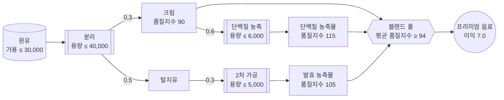
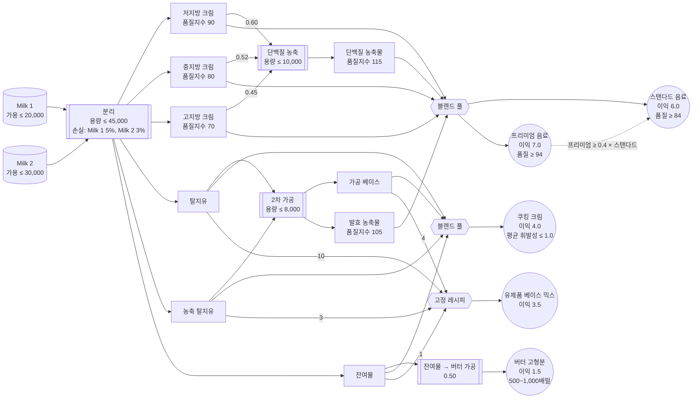

# 4. Gurobi Modeler로 최적화 모델 만들기

지금까지(0~3번 노트북)는 문제를 직접 수식으로 세우고 `gurobipy` 코드를 한 줄씩 작성했습니다.
이번 실습부터는 **Gurobi Intelligence Hub**의 AI 에이전트를 사용해 자연어로 문제를 설명하고,
모델 스펙 작성부터 `gurobipy` 구현, 테스트 작성까지 에이전트가 만들어주는 과정을 경험합니다.

> ⚠️ 이 문서에는 실행할 코드가 없습니다. 실제 모델링 작업은 웹 브라우저에서
> **[intelligence.gurobi.com](https://intelligence.gurobi.com)** 에 접속해 진행합니다.
> 이 문서는 실습에 필요한 문제 설명, 진행 가이드, 그리고 참고할 수 있는 예상 결과를 제공합니다.

---

## Intelligence Hub란?

Gurobi Intelligence Hub는 Gurobi의 AI 에이전트를 한 곳에서 사용할 수 있는 웹 서비스입니다.

| 에이전트 | 상태 | 역할 |
|---|---|---|
| **Gurobot** | GA | Gurobi 제품/문법/라이선스 전반에 대한 상시 지원 전문가 |
| **Modeler** | Beta | 비즈니스 문제 설명 → 검증된 `gurobipy` 코드로 안내 |
| **Explainer** | Experimental | 이미 만들어진 모델 인스턴스를 진단·해석 (다음 문서에서 사용) |

모든 답변은 Gurobi의 공식 문서·예제·모범 사례에 기반하며, 채팅/파일은 세션별로 격리되어 처리됩니다.

## Modeler란?

**Modeler**는 사용자를 문제 설명에서부터 검증된, 실행 가능한 `gurobipy` 코드까지 점진적으로 안내하는
모델링 어시스턴트입니다.

- **대화형 스펙 작성**: 목적함수, 제약, 입력/출력, 테스트 시나리오를 한 번에 하나씩 질문하며 구체화합니다.
- **비즈니스 중심 워크플로**: 사용자가 수식이 아니라 실제 문제에 계속 집중하도록 안내합니다.
- **Acceptance Test 기반 검증**: 스펙을 바탕으로 pytest 테스트 시나리오를 생성하고, 직접 실행해서
  통과/실패를 확인한 뒤 필요하면 스스로 수정합니다.
- **반복 가능한 설계**: 문제가 바뀌면 스펙을 업데이트하고, AI가 모델과 테스트에 변경 사항을 반영합니다.

> 💡 **주의**: Modeler는 "정확한(correct)" 모델을 만들도록 도와주지만, "가장 효율적인(performant)"
> 모델을 보장하지는 않습니다. AI가 생성한 모델을 무조건 신뢰하지 말고, 이 문서의 워밍업처럼
> 작은 acceptance test로 직접 검증하는 습관을 들이세요.

## 실습 목표

이번 실습은 세 부분으로 구성됩니다.

- **Part 0. 워밍업**: 이미 정답을 알고 있는 초급 문제를 Modeler에게 맡겨보면서, AI가 만든 모델을
  어떻게 신뢰·검증하는지 체감합니다.
- **Part 1. 본 실습**: 유가공(乳加工) 공장에서 프리미엄 유제품 음료 하나를 생산하는 단순화된
  문제를 Modeler에게 설명하여, **총 이익을 최대화하는 생산 계획 모델**을 만들고 **feasible한
  (실행 가능한) 최적해**를 얻습니다. 30분 안에 끝낼 수 있는 분량입니다.
- **부록. 전체 공정 모델**: 같은 공장을 훨씬 더 현실적으로 확장한 버전입니다. 시간이 남거나 더
  도전해보고 싶다면 시도해보세요 — 다음 실습(`5_Explainer`)은 이 부록의 모델을 그대로 사용합니다.

## Part 0. 워밍업 — 이미 답을 아는 문제로 Modeler 검증하기

본격적으로 새로운 문제를 다루기 전에, 여러분이 이미 손으로 직접 코딩해서 **정답을 알고 있는 문제**를
Modeler에게 그대로 맡겨보고 결과를 비교해봅니다. Modeler 소개에서 강조했듯, AI가 만든 모델을
신뢰하려면 이미 답을 아는 작은 문제로 직접 검증해보는 습관이 중요합니다.

**사용할 문제**: 초급 [`3_생산재고관리문제_답안.ipynb`](../초급/3_생산재고관리문제_답안.ipynb)의 다기간 생산·재고 관리 문제

월별 수요·생산 단가·재고 유지비·생산 능력 데이터는 `중급/3_생산재고관리문제_data.csv`
(month, demand, production_cost, holding_cost, production_capacity 열)로 별도 제공됩니다.

### Modeler 프롬프트 예시

Intelligence Hub 채팅창에 아래 프롬프트를 그대로 붙여넣고, `3_생산재고관리문제_data.csv`
파일을 함께 첨부하세요. (막히면 펼쳐보되, 먼저 스스로 문제를 설명해보길 권합니다.)

펼쳐서 프롬프트 보기

> 우리 공장의 12개월 생산·재고 계획을 최적화하고 싶어.
>
> 한 가지 제품을 매달 생산해서 재고로 쌓아두고, 그 재고로 그달 수요를 맞추고 있어.
>
> 매달 생산할 수 있는 최대 수량(생산 능력)이 정해져 있어서 그 이상은 생산 못 해. 제품을 하나
> 생산할 때마다 드는 생산 비용이랑, 안 팔리고 재고로 남은 제품에 매달 드는 재고 유지비가
> 있는데, 둘 다 월별로 금액이 달라.
>
> 재고는 지난달에서 그대로 이월된 뒤, 이번 달 생산한 만큼 늘고 이번 달 수요만큼 팔려서 줄어드는
> 식으로 매달 이어져. 첫 달은 재고가 하나도 없는 상태에서 시작하고, 재고가 마이너스가 되면 안 돼.
>
> 월별 수요, 생산 단가, 재고 유지비, 생산 능력은 첨부한 CSV 파일
> (`3_생산재고관리문제_data.csv`)에 정리해 뒀어.
>
> 12개월 전체 기간의 생산 비용과 재고 유지비를 합친 총 비용을 최소화하는 월별 생산 계획을
> 세워 줘.

### 진행 방법

1. 위 프롬프트를 Intelligence Hub의 **Modeler**에 전달하고, `3_생산재고관리문제_data.csv`
   파일을 함께 첨부합니다.
2. Modeler가 명세를 구체화하기 위해 던지는 질문(예: 생산량을 정수로 볼지 연속값으로 볼지,
   기말 재고 조건, 수요를 못 맞췄을 때 처리 방식 등)에 하나씩 답합니다.
3. 명세가 완성되면 "**수리모형부터 보여줘**"처럼 요청해서 Modeler가 세운 집합·변수·목적함수·
   제약을 확인하고, 우리가 말로 설명한 내용과 맞는지 살펴봅니다.
4. 이어서 "**gurobipy로 구현하고, 첨부한 CSV 데이터로 최적화해줘**"라고 요청해 코드를 생성·
   실행받습니다.
5. 나온 **총 비용(목적함수 값)**과 월별 생산량·재고량이 [초급 노트북](../초급/3_생산재고관리문제_답안.ipynb)에서 이미 확인한 답과 일치하는지
   비교합니다.
6. 만약 다르다면 무엇이, 왜 다른지(생산량을 정수/연속 중 무엇으로 처리했는지, 재고 균형식의 초기
   재고 처리 등) Modeler와의 대화를 통해 찾아내고 수정을 요청해보세요.

### 워밍업 예상 결과

| 항목 | 초급 답안 (직접 코딩) | Modeler 결과 |
|---|---|---|
| 목적함수 값 (총 비용, 최소화) | 4,250.00 | **4,250.00** (일치해야 함) |
| 1월 생산량 / 재고량 | 40 / 0 | 40 / 0 |
| 7월 생산량 / 재고량 | 100 / 10 | 100 / 10 |
| 일치 여부 | - | ✅ 일치 |

## Part 1. 본 실습 — 프리미엄 유제품 음료 생산 계획

워밍업에서 Modeler를 사용하는 방법을 익혔다면, 이번에는 **정답을 모르는 새로운 문제**를
Modeler와 함께 처음부터 모델링해봅니다. (이 공장의 훨씬 더 현실적인 버전은 문서 맨 뒤 부록에
있습니다 — 이번 Part 1은 30분 안에 끝낼 수 있도록 단순화한 버전입니다.)

### 비즈니스 문제 설명

한 유가공 공장이 원유를 사서 **프리미엄 유제품 음료** 하나를 만듭니다.

원유는 분리 설비를 거치면 크림과 탈지유로 나뉩니다. 크림은 그대로 음료에 섞어도 되고,
**단백질 농축 설비**를 거치면 더 고품질인 단백질 농축물로 바뀝니다. 탈지유는 그 자체로는
음료에 쓸 수 없고, **2차 가공 설비**를 거쳐야 발효 농축물이 되어 음료 재료로 쓰입니다.

음료는 이 세 가지(크림·단백질 농축물·발효 농축물)를 부피 기준으로 블렌딩해서 만드는데, 평균
품질지수가 **94 이상**이어야 판매할 수 있습니다. (품질지수는 실제 성분표가 아니라, 부피 기준으로
섞으면 그대로 평균이 나는 점수입니다 — 예를 들어 품질지수 90짜리와 115짜리를 절반씩 섞으면
정확히 102.5가 됩니다.)

| 스트림 | 수율 (배럴/배럴) | 품질지수 |
|---|---|---|
| 크림 (원유 분리 직후) | 0.3 (원유 기준) | 90 |
| 탈지유 (원유 분리 직후) | 0.5 (원유 기준) | 직접 사용 불가 |
| 단백질 농축물 | 0.6 (크림 기준) | 115 |
| 발효 농축물 | 0.3 (탈지유 기준) | 105 |

| 설비 / 자원 | 하루 한도 |
|---|---|
| 원유 구매 | 30,000배럴 |
| 분리 설비 | 40,000배럴 |
| 단백질 농축 설비 | 6,000배럴 |
| 2차 가공 설비 | 5,000배럴 |

음료는 배럴당 **7.0(백 달러)**의 이익을 냅니다.

아래 다이어그램은 원유가 분리·가공을 거쳐 프리미엄 음료가 되기까지의 흐름을 보여줍니다. 화살표
옆의 숫자는 배럴당 수율, 점선은 최종 제품이 만족해야 하는 제약입니다.

**목표**: 하루 이익을 최대화하는 생산 계획을 세우세요.

### 진행 방법

Modeler는 문제 설명을 한 번에 다 받지 않고, **한 번에 하나씩 질문하며** 스펙을 구체화하는
방식으로 동작합니다.

1. 그래서 문제를 한 번에 다 설명하지 말고 짧게 시작해서, Modeler가 순서대로 묻는 질문
   (공정/수율, 배합 방식, 조달 방식, 비용, 용량 제약, 판매 조건 등)에 하나씩 답합니다.
   (대화가 실제로 어떻게 흘러가는지는 아래 "Modeler 프롬프트 예시"를 참고하세요.)
2. 명세가 완성되면 "**수리모형부터 보여줘**"처럼 요청해서 Modeler가 세운 집합·변수·목적함수·
   제약을 확인하고, 우리가 말로 설명한 내용과 맞는지 살펴봅니다.
3. 이어서 "**gurobipy로 구현하고 최적화까지 실행해줘**"라고 요청해 코드를 생성·실행받습니다.
4. 나온 **총 이익(목적함수 값)**과 각 설비 사용량이 아래 "Part 1 예상 결과"와 일치하는지
   비교합니다.
5. 만약 다르다면 무엇이, 왜 다른지(물질 균형 제약의 부등호 방향, 품질 제약의 부등호 방향,
   설비 용량 제약 등) Modeler와의 대화를 통해 찾아내고 수정을 요청해보세요. (아래 "Modeler
   프롬프트 예시" 마지막 부분에 실제로 이런 상황을 겪은 사례가 있습니다.)

### Part 1 예상 결과

Modeler가 생성한 모델을 실행한 결과입니다. (이익 단위: 백 달러 = USD 100)

| 항목 | 값 |
|---|---|
| Optimization Status | OPTIMAL |
| 총 이익 (목적함수 값) | **70,210.84** |
| 원유 사용량 (≤ 30,000) | 30,000.00 (상한 도달) |
| 단백질 농축 설비 사용량 (≤ 6,000) | 약 1,174.70 (여유 있음) |
| 2차 가공 설비 사용량 (≤ 5,000) | 5,000.00 (상한 도달) |

| 스트림 | 생산량 (배럴) |
|---|---|
| 크림 (직접 블렌딩) | 약 7,825.30 |
| 단백질 농축물 | 약 704.82 |
| 발효 농축물 | 1,500.00 |
| **프리미엄 유제품 음료 (총 생산량)** | 약 10,030.12 |

> ※ 실제 Modeler가 생성하는 변수명·구현 방식은 위와 다를 수 있지만, 스펙에 이 문서의 문제
> 설명이 빠짐없이 반영되었다면 최적값은 위와 동일해야 합니다. 값이 다르다면 스펙이나 구현에
> 누락된 제약이 없는지 다시 확인하세요.

### Modeler 프롬프트 예시

위 "진행 방법"대로 진행하되, 실제로 대화가 어떤 식으로 오가는지 감이 안 잡히면 아래 예시를
펼쳐보세요. (막히면 펼쳐보되, 먼저 스스로 대화를 이끌어보길 권합니다.)

펼쳐서 대화 예시 보기

> **나**: 우리 유가공 공장의 하루 생산 계획을 최적화하고 싶어. 원유를 사서 프리미엄 유제품
> 음료 하나를 만드는 문제야. 도와줄 수 있어?

Modeler는 바로 스펙을 짜지 않고, 목적함수부터 확인하는 객관식 질문을 던집니다 (예: "비용
최소화 / 수익 최대화 / 이익 최대화 / 생산량 최대화 중 어디에 가깝나요?").

> **나**: 이익 최대화야. 공정을 설명할게: 원유를 분리 설비에 넣으면 크림이랑 탈지유가 나와.
> 원유 1배럴당 크림 0.3배럴, 탈지유 0.5배럴이 나오고 나머지는 공정 손실이야.

Modeler: "음료의 배합(레시피)은 어떻게 되나요? 고정 비율 혼합인가요, 아니면 품질 기준만
만족하면 되는 유연한 혼합인가요?"

> **나**: 크림·단백질 농축물·발효 농축물 세 가지를 부피 기준으로 자유롭게 섞어서 만드는데,
> 평균 품질지수가 94 이상이어야 팔 수 있어. 크림은 그 자체로 품질지수 90이고, 크림을 단백질
> 농축 설비에 넣으면 품질지수 115짜리 단백질 농축물로 바뀌는데 크림 1배럴당 0.6배럴이 나와.

Modeler: "발효 농축물은 어떻게 만들어지나요? 외부 구매인가요, 아니면 탈지유를 가공해서
만드나요? 품질지수도 알려주세요."

> **나**: 탈지유는 그 자체로는 음료에 못 쓰고, 2차 가공 설비를 거쳐야 품질지수 105짜리 발효
> 농축물이 되고, 이게 음료 재료로 쓰여. 탈지유 1배럴을 넣으면 발효 농축물 0.3배럴이 나와.

Modeler는 이어서 비용·가격 구조를 묻습니다.

> **나**: 따로 원가 항목은 없고, 음료는 배럴당 7.0(백 달러)의 순이익을 낸다고만 알고 있어.
> 즉 음료 생산량 × 7.0을 최대화하면 돼.

Modeler: "하루에 구매 가능한 원유 양이나 설비 처리 용량에 제한이 있나요?"

> **나**: 둘 다 있어. 원유는 하루 최대 30,000배럴까지 살 수 있고, 분리 설비는 하루
> 40,000배럴까지 처리할 수 있어. 단백질 농축 설비는 하루 6,000배럴, 2차 가공 설비는 하루
> 5,000배럴까지만 처리할 수 있어.

Modeler는 이어서 "생산된 음료를 전량 판매할 수 있나요?", "블렌딩 비율에 추가 제약이 있나요?"
처럼 한두 번 더 세부 사항을 확인합니다 — 이 문제에서는 "전량 판매 가능하고, 비율 제약 없이
품질지수 94만 만족하면 돼"처럼 짧게 답하면 됩니다.

명세가 다 채워졌다 싶으면, 코드부터 요청하지 말고 수리모형을 먼저 확인합니다.

> **나**: 좋아, 구현하기 전에 수리모형부터 보여줘 (집합, 변수, 목적함수, 제약).

Modeler는 아래와 같이 완성된 수리모형을 정리해서 보여줍니다. 우리가 말로 설명한 내용과
빠짐없이 맞는지 하나씩 대조해봅니다.

**결정 변수 (7개)**

| 변수 | 의미 |
|---|---|
| $x$ | 하루 원유 구매량 (배럴) |
| $c_b$ | 블렌딩에 직접 투입되는 크림 |
| $c_p$ | 단백질 농축 설비에 투입되는 크림 |
| $p$ | 생산된 단백질 농축물 |
| $s$ | 발효 설비에 투입되는 탈지유 |
| $f$ | 생산된 발효 농축물 |
| $b$ | 생산된 프리미엄 음료 |

**목적함수**

$$\max \quad 7.0 \cdot b$$

**제약 조건**

$$x \leq 30{,}000 \quad \text{(C1: 원유 구매 상한)}$$

$$x \leq 40{,}000 \quad \text{(C2: 분리 설비 용량 — C1에 의해 사실상 비구속)}$$

$$c_p \leq 6{,}000 \quad \text{(C3: 단백질 농축 설비 용량)}$$

$$s \leq 5{,}000 \quad \text{(C4: 발효 설비 용량)}$$

$$c_b + c_p = 0.3x \quad \text{(C5: 크림 물질 균형)}$$

$$s = 0.5x \quad \text{(C6: 탈지유 물질 균형)}$$

$$p = 0.6 \cdot c_p \quad \text{(C7: 단백질 농축물 균형)}$$

$$f = 0.3 \cdot s \quad \text{(C8: 발효 농축물 균형)}$$

$$b = c_b + p + f \quad \text{(C9: 음료 생산량 균형)}$$

$$-4 \cdot c_b + 21 \cdot p + 11 \cdot f \geq 0 \quad \text{(C10: 품질 요건 } \tfrac{90c_b+115p+105f}{b}\geq 94 \text{ 를 선형화)}$$

$$x, c_b, c_p, p, s, f, b \geq 0 \quad \text{(C11: 비음 조건)}$$

수리모형이 말로 설명한 내용과 맞다고 확인되면 구현을 요청합니다.

> **나**: 수리모형 맞아. gurobipy로 구현하고 최적화까지 실행해줘.

Modeler가 코드를 실행한 결과: 이익 31,500(백 달러), 프리미엄 음료 4,500배럴, 원유 구매량
10,000배럴(상한 30,000의 1/3만 사용), 2차 가공 설비는 5,000배럴로 풀가동.

> **나**: 잠깐, 원유 구매량이 상한(30,000배럴)에 도달을 안 했네? 탈지유를 2차 가공 설비
> 용량만큼만 가공하고 나머지는 그냥 버리면 되는 거 아니야? 꼭 탈지유를 100% 다 가공해야
> 하는 건 아니잖아.

Modeler가 다시 살펴보니, 위 수리모형의 **C5·C6가 부등식이 아니라 등식**(`c_b + c_p = 0.3x`,
`s = 0.5x`)으로 세워져 있었습니다. 즉 "분리된 크림·탈지유는 반드시 다 써야 한다"는 제약이
스펙에 암묵적으로 들어가 있었던 것입니다. 나머지 제약(C1~C4, C7~C11)은 그대로 두고, C5·C6만
아래처럼 등식(`=`)에서 부등식(`≤`, 즉 "생산량만큼 쓸 수 있지만 다 쓸 필요는 없다")으로
고칩니다.

$$c_b + c_p \leq 0.3x \quad \text{(C5 수정: 크림 물질 균형 — 남는 크림은 버릴 수 있음)}$$

$$s \leq 0.5x \quad \text{(C6 수정: 탈지유 물질 균형 — 남는 탈지유는 버릴 수 있음)}$$

이렇게 고쳐서 다시 최적화한 새 결과: 이익 70,210.84, 프리미엄 음료 10,030배럴, 원유 구매량
30,000배럴(상한 도달).

> ※ 실제 대화에서 Modeler가 묻는 순서나 정확한 문구는 위 예시와 다를 수 있습니다. 중요한 건
> "목적함수 → 공정/수율 → 품질 제약 → 용량 제약 → 판매 조건" 순으로 정보를 채워나가는 흐름이지,
> 질문의 정확한 표현이 아닙니다. 다만 위 대화 마지막 부분(원유가 상한에 도달 안 한 문제)은
> 실제로 이 문서를 준비하며 겪은 사례를 그대로 옮긴 것입니다 — Modeler가 만든 모델을 그대로
> 믿지 말고, 이렇게 설비별 사용량이 이상하게 낮은 곳은 없는지 직접 확인하는 습관이 중요합니다.

---

## 부록. 유가공 공장 전체 공정 모델

Part 1은 이 공장을 아주 단순화한 버전이었습니다. 실제로는 원유가 **두 종류**이고, 크림도
**저지방·중지방·고지방 3단계**로 나뉘며, 최종 제품도 **다섯 가지**(스탠다드/프리미엄 음료,
쿠킹 크림, 유제품 베이스 믹스, 버터 고형분)나 됩니다. 아래는 그 전체 버전입니다.

> 📌 다음 실습(`5_Explainer`)은 **이 부록의 모델을 그대로 사용합니다.** 시간이 남거나 더
> 도전해보고 싶다면 Modeler로 직접 만들어보세요. 그렇지 않더라도 아래 문제 설명은 다음
> 실습을 이해하는 배경 지식이 되니 한 번 읽어보길 권합니다.

### 비즈니스 문제 설명

한 유가공업체가 서로 다른 공급업체로부터 **두 종류의 원유**(Milk 1, Milk 2)를 구매해, 다음
**4단계 공정**을 거쳐 마진이 서로 다른 **소비자용 유제품과 원료 다섯 가지**로 가공·판매합니다.

1. 분리 (Separation) — 원유를 크림 3등급 + 탈지유 계열 2종 + 잔여물, 총 6가지 성분으로 분리
2. 단백질 농축 (Protein Concentration) — 크림을 고품질 단백질 농축물로 가공
3. 2차 가공 (Secondary Processing) — 탈지유 계열을 가공 베이스·발효 농축물로 가공
4. 제품 블렌딩 (Product Blending) — 위 원료들을 배합해 다섯 가지 최종 제품 생산

> 💡 아래 내용을 이해하는 데 필요한 핵심 개념 하나만 먼저 짚고 갑니다. 뒤에 나오는 **품질지수**는
> 지방·단백질 함량 같은 실제 성분표가 아니라, **부피 기준으로 섞으면 그대로 평균이 나는 추상적인
> 점수**입니다(예: 품질지수 90짜리와 70짜리를 절반씩 섞으면 정확히 80이 됩니다). 최종 음용
> 유제품은 이 지수가 일정 기준(84 또는 94) 이상이어야 판매할 수 있는데, 원유를 분리해서 얻는
> 크림 자체의 지수는 70~90에 그칩니다. 그래서 2·3단계처럼 별도 설비로 크림·탈지유를 추가
> 가공해서 지수 105~115의 더 고품질 원료로 바꾸는 공정이 필요합니다 — 다만 이 가공 설비들은
> 하루 처리 용량이 정해져 있어서, "얼마나 가공해서 품질을 끌어올릴지"가 이 문제 전체의 핵심
> 트레이드오프입니다.

**1단계 — 분리**: 원유는 원심분리·여과를 통해 6가지 성분으로 나뉩니다. 원유 1배럴당 수율(공정
손실 반영, Milk 1은 약 5%, Milk 2는 약 3% 손실)과 크림 3등급의 품질지수는 다음과 같습니다.
(탈지유 계열은 그 자체로는 음용 제품에 쓸 수 없고, 잔여물은 원심분리 후 남는 고형 찌꺼기입니다.)

| 성분 | Milk 1 수율 | Milk 2 수율 | 품질지수 |
|---|---|---|---|
| Light Cream (저지방 크림) | 0.10 | 0.15 | 90 |
| Medium Cream (중지방 크림) | 0.20 | 0.25 | 80 |
| Heavy Cream (고지방 크림) | 0.20 | 0.18 | 70 |
| Skim Milk (탈지유) | 0.12 | 0.08 | 직접 사용 불가 |
| Concentrated Skim (농축 탈지유) | 0.20 | 0.19 | 직접 사용 불가 |
| Residual Solids (잔여물) | 0.13 | 0.12 | — (버터 가공 전용) |

**2단계 — 단백질 농축**: 세 크림 분획은 바로 블렌딩에 쓰거나, **단백질 농축 설비**(한외여과 —
미세한 막으로 물 분자만 걸러내 단백질을 진하게 농축하는 공정)를 거쳐 품질지수 **115**의 고단백
농축물로 바꿀 수 있습니다.

| 원료 | 단백질 농축물 수율 (배럴/배럴) |
|---|---|
| Light Cream | 0.60 |
| Medium Cream | 0.52 |
| Heavy Cream | 0.45 |

**3단계 — 2차 가공**: 탈지유·농축 탈지유는 바로 블렌딩에 쓰거나, **2차 가공 설비**를 거쳐 가공
베이스(Processed base)와 발효 농축물(유산균 등으로 발효시킨 품질지수 **105** 농축물)로 바뀝니다.
잔여물은 별도로 버터 상당 고형분으로 가공할 수 있습니다.

| 원료 | 가공 베이스 수율 | 발효 농축물 수율 |
|---|---|---|
| Skim Milk | 0.68 | 0.28 |
| Concentrated Skim | 0.75 | 0.20 |

| 원료 | 버터 고형분 수율 |
|---|---|
| Residual Solids | 0.50 |

**4단계 — 블렌딩**: 위 원료들을 배합해 다섯 가지 최종 제품을 만듭니다. 블렌딩되는 지수(품질지수,
휘발성 지수)는 모두 앞선 콜아웃과 같은 방식(부피 기준 선형 평균)으로 계산됩니다.

| 제품 | 블렌딩 원료 | 품질/제약 조건 |
|---|---|---|
| Premium Dairy Drink | 크림 3등급 + 단백질 농축물 + 발효 농축물 (자유 배합) | 품질지수 ≥ 94 |
| Standard Dairy Drink | 〃 | 품질지수 ≥ 84; Premium 생산량 ≥ 0.4 × Standard 생산량 |
| Cooking Cream | 탈지유 + 농축 탈지유 + 가공 베이스 + 잔여물 (자유 배합) | 휘발성 지수 ≤ 1.0 (아래 표) |
| Dairy Base Mix | 탈지유 : 가공 베이스 : 농축 탈지유 : 잔여물 = 10 : 4 : 3 : 1 (고정 비율) | — |
| Butter Solids | 잔여물 가공 | 하루 생산량 500 ~ 1,000배럴 |

| Cooking Cream 배합 원료 | 휘발성 지수 |
|---|---|
| Skim Milk | 1.0 |
| Concentrated Skim | 0.6 |
| Processed Base | 1.5 |
| Residue | 0.05 |

**설비·자원 하루 한도**

| 설비 / 자원 | 하루 한도 |
|---|---|
| Milk 1 구매 | 20,000배럴 |
| Milk 2 구매 | 30,000배럴 |
| 분리 설비 | 45,000배럴 |
| 단백질 농축 설비 | 10,000배럴 |
| 2차 가공 설비 | 8,000배럴 |

**수익 기여 (배럴당, 단위: 백 달러)**

| 제품 | 이익 |
|---|---|
| Premium Dairy Drink | 7.0 |
| Standard Dairy Drink | 6.0 |
| Cooking Cream | 4.0 |
| Dairy Base Mix | 3.5 |
| Butter Solids | 1.5 |

아래 다이어그램은 원유 두 종류가 분리·가공을 거쳐 다섯 가지 최종 제품으로 이어지는 전체 흐름을
한눈에 보여줍니다. 스트림 옆의 숫자는 배럴당 수율이고, 각 최종 제품이 만족해야 하는 제약은 노드
안에 함께 표시했습니다(점선은 프리미엄·스탠다드 음료 사이의 비율 제약처럼 서로 다른 두 제품에
걸친 제약입니다).

**목표**: 위 다섯 가지 최종 제품의 총 이익을 최대화하는 하루 생산 계획을 수립하세요.

### 진행 방법

Part 1과 마찬가지로, Modeler는 문제 설명을 한 번에 다 받지 않고 **한 번에 하나씩 질문하며**
스펙을 구체화하는 방식으로 동작합니다.

1. 위 "비즈니스 문제 설명"을 한 번에 다 설명하지 말고 짧게 시작해서, Modeler가 순서대로 묻는
   질문(원유별 분리 수율, 단백질 농축·2차 가공 공정, 다섯 가지 제품의 배합 방식, 용량 제약,
   판매 조건 등)에 하나씩 답합니다. (대화가 실제로 어떻게 흘러가는지는 아래 "Modeler 프롬프트
   예시"를 참고하세요.)
2. 명세가 완성되면 "**수리모형부터 보여줘**"처럼 요청해서 Modeler가 세운 집합·변수·목적함수·
   제약을 확인하고, 우리가 말로 설명한 내용과 맞는지 살펴봅니다.
3. 이어서 "**gurobipy로 구현하고 최적화까지 실행해줘**"라고 요청해 코드를 생성·실행받습니다.
4. 나온 **총 이익(목적함수 값)**과 제품별 생산량이 아래 "부록 예상 결과"와 일치하는지 비교합니다.
   특히 다음 항목은 놓치기 쉬우니 함께 확인하세요.
   - 다섯 개 최종 제품(Premium/Standard drink, Cooking cream, Dairy base mix, Butter solids)
     변수가 모두 있는지
   - Butter Solids 생산량이 500 ~ 1,000배럴 사이인지
   - Premium Dairy Drink ≥ 0.4 × Standard Dairy Drink 를 만족하는지
   - Milk 1 사용량 ≤ 20,000, Milk 2 사용량 ≤ 30,000 인지
5. 만약 다르다면 무엇이, 왜 다른지(물질 균형 제약의 부등호 방향, 배합·비율 제약, 품질·휘발성
   제약, 설비 용량 제약 등) Modeler와의 대화를 통해 찾아내고 수정을 요청해보세요.
6. 다음 실습(`5_Explainer`)에서 이 모델을 그대로 사용하니, 코드 끝에 `model.write("moodel.lp")`를
   추가해 실행하고 생성된 LP 파일을 잘 보관해 두세요.

### 부록 예상 결과

Modeler가 생성한 모델을 실행한 결과입니다. (이익 단위: 백 달러 = USD 100)

| 항목 | 값 |
|---|---|
| Optimization Status | OPTIMAL |
| 총 이익 (목적함수 값) | **211,365.13** |
| Milk 1 사용량 (≤ 20,000) | 15,000.00 (여유 있음) |
| Milk 2 사용량 (≤ 30,000) | 30,000.00 (상한 도달) |

| 최종 제품 | 생산량 (배럴) | 이익 기여 (백 달러) |
|---|---|---|
| Premium Dairy Drink | 6,817.78 | 47,724.45 |
| Standard Dairy Drink | 17,044.45 | 102,266.68 |
| Cooking Cream | 15,156.00 | 60,624.00 |
| Dairy Base Mix | 0.00 | 0.00 |
| Butter Solids | 500.00 | 750.00 |

> ※ 실제 Modeler가 생성하는 변수명·구현 방식은 위와 다를 수 있지만, 스펙에 이 문서의 문제
> 설명이 빠짐없이 반영되었다면 최적값은 위와 동일해야 합니다. 값이 다르다면 스펙이나 구현에
> 누락된 제약이 없는지 다시 확인하세요.

### Modeler 프롬프트 예시

아래는 실제로 Intelligence Hub의 Modeler API를 호출해 이 문제를 처음부터 끝까지 모델링한
대화 그대로입니다 (표현만 다듬었을 뿐, 질문·답변 순서와 내용은 실제 세션과 같습니다). 진행하기
전에 먼저 스스로 대화를 이끌어보고, 막히면 아래를 펼쳐 참고하세요.

펼쳐서 대화 예시 보기

> **나**: 우리 유가공업체의 하루 생산 계획을 최적화하고 싶어. 원유 두 종류를 사서 다섯 가지
> 최종 제품을 만드는 문제야. 도와줄 수 있어?

Modeler는 바로 스펙을 짜지 않고, 목적함수부터 확인하는 객관식 질문을 던집니다 ("이익 극대화 /
비용 최소화 / 생산량 극대화 / 기타 중 어느 것에 가깝나요?").

> **나**: 이익 최대화야(원유 구매 비용은 없고, 순수하게 판매 수익만 고려하면 돼). 원유는
> Milk 1, Milk 2 두 종류를 사는데, 분리 설비에 넣으면 저지방·중지방·고지방 크림 3종과 탈지유,
> 농축 탈지유, 잔여물까지 총 6가지 성분으로 나뉘어. (원유별 수율·품질지수 표 전달 — 품질지수는
> 부피 기준 선형 평균이라는 설명도 함께)

Modeler: "최종 제품 5가지는 무엇인가요? 각 제품마다 어떤 성분이 들어가는지, 단가(배럴당
판매가격)도 함께 알려주세요."

> **나**: 먼저 분리 이후 추가 가공 단계가 두 개 더 있어. 단백질 농축 설비(크림 → 품질지수 115
> 단백질 농축물, 하루 10,000배럴 한도)와 2차 가공 설비(탈지유 계열 → 가공 베이스 + 발효
> 농축물, 하루 8,000배럴 한도). 잔여물은 그대로 버터 고형분으로 가공해. 이제 최종 제품 5가지야
> — Premium/Standard Dairy Drink(자유 배합 + 품질지수 제약 + 40% 비율 제약), Cooking
> Cream(자유 배합 + 휘발성 지수 제약), Dairy Base Mix(10:4:3:1 고정 비율), Butter Solids
> (500~1,000배럴 범위). (수율·품질·이익 수치 전달)

Modeler: "분리된 성분 중 사용되지 않은 잉여분은 어떻게 처리되나요? **폐기 허용** / 전량 사용
강제 / 폐기 시 비용 발생 / 성분별로 다름 중에서 선택해 주세요."

> 💡 **곁다리 해설**: 이 질문이 이번 대화의 핵심 갈림길입니다 — Part 1에서 실제로 겪었던 "분리된
> 크림·탈지유를 반드시 다 써야 하는가" 문제와 정확히 같은 지점을, Modeler가 구현 전에 먼저
> 물어봐 준 것입니다.

> **나**: 폐기 허용이야. 분리·단백질 농축·2차 가공 어느 단계에서든 남는 성분은 그냥 버려도
> 되고, 전량 사용을 강제할 필요는 없어.

Modeler: "잔여물처럼 여러 용도로 쓰이는 성분은, 그 용도들 사이에 자유롭게 배분할 수 있나요?"

> **나**: 응, 자유 배분 가능이야. 크림 3종·탈지유 계열·잔여물 모두 여러 용도(직접 블렌딩,
> 추가 가공, 다른 최종 제품) 사이에 최적화가 원하는 만큼 나눠 쓸 수 있어.

Modeler: "Premium/Standard/Cooking Cream/Dairy Base Mix에 대해 별도의 최소·최대 생산량 제약이
있나요?"

> **나**: 없음이야. 앞서 말한 Premium ≥ 0.4 × Standard 비율 제약과 Butter Solids
> 500~1,000배럴 범위 제약, 이 두 개가 생산량 관련 제약의 전부야. 판매도 생산되는 만큼 전량
> 가능하다고 가정하면 돼.

명세가 다 채워졌다 싶으면, 코드부터 요청하지 말고 수리모형을 먼저 확인합니다.

> **나**: 구현하기 전에 수리모형부터 보여줘 (집합, 변수, 목적함수, 제약).

Modeler가 정리해준 수리모형은 다음과 같습니다 (집합 $K$=크림 3종 {LC, MC, HC}, $S$=탈지유 계열
{SM, CS}, $M$={Milk1, Milk2}).

**결정 변수**

| 변수 | 의미 |
|---|---|
| $x_m$ | 원유 $m$ 조달량 |
| $u^{blend}_k,\ u^{PC}_k$ | 크림 $k$의 직접 블렌딩 투입량 / 단백질 농축 설비 투입량 |
| $w^{blend}_s,\ w^{SP}_s$ | 탈지유 계열 $s$의 직접 블렌딩 투입량 / 2차 가공 설비 투입량 |
| $r^{CC},\ r^{DBM},\ r^{BS}$ | 잔여물의 Cooking Cream / Dairy Base Mix / 버터 가공 배분량 |
| $b^{PRE}_i,\ b^{STD}_i$ | Premium/Standard 음료에 블렌딩되는 원료 $i$의 양 ($i \in \{LC,MC,HC,PC,FC\}$) |
| $b^{CC}_i,\ b^{DBM}_i$ | Cooking Cream / Dairy Base Mix에 블렌딩되는 원료 $i$의 양 |
| $\lambda$ | Dairy Base Mix 고정 비율(10:4:3:1)의 스케일 변수 |
| $\text{Vol}_p$ | 최종 제품 $p$의 총 생산량 ($p \in \{PRE,STD,CC,DBM,BS\}$) |

아래 제약식에는 결정 변수 외에 다음 **파라미터**(고정된 수치)도 등장합니다. 값은 모두 위
"비즈니스 문제 설명"에 나온 표 그대로입니다.

| 기호 | 의미 | 값 |
|---|---|---|
| $y_{c,m}$ | 원유 $m$ 1배럴당 성분 $c$의 분리 수율 | "1단계 — 분리" 표 |
| $\alpha^{PC}_k,\ \beta^{PB}_s,\ \beta^{FC}_s,\ \alpha^{BS}$ | 크림 $k$→단백질 농축물, 탈지유 계열 $s$→가공 베이스/발효 농축물, 잔여물→버터 고형분 수율 | "2·3단계" 표 |
| $q_i$ | 블렌딩 원료 $i$의 품질지수 (LC 90, MC 80, HC 70, PC 115, FC 105) | "1단계·2단계·3단계" 표 |
| $v_i$ | Cooking Cream 원료 $i$의 휘발성 지수 (SM 1.0, CS 0.6, PB 1.5, RS 0.05) | "4단계 — 블렌딩" 표 |

**목적함수**

$$\max \quad Z = 7.0\,\text{Vol}&#95;{PRE} + 6.0\,\text{Vol}&#95;{STD} + 4.0\,\text{Vol}&#95;{CC} + 3.5\,\text{Vol}&#95;{DBM} + 1.5\,\text{Vol}&#95;{BS}$$

**제약 조건**

$$x_{Milk1} \leq 20{,}000, \quad x_{Milk2} \leq 30{,}000 \quad \text{(C1: 원유 조달 한도)}$$

$$\textstyle\sum_{m} x_m \leq 45{,}000 \quad \text{(C2: 분리 설비 용량)}$$

$$u^{blend}&#95;k + u^{PC}&#95;k \leq \textstyle\sum_{m} y_{k,m}\,x_m \quad \forall k \in K \quad \text{(C3a: 크림 물질 균형 — 잉여 폐기 허용)}$$

$$w^{blend}&#95;s + w^{SP}&#95;s \leq \textstyle\sum_{m} y_{s,m}\,x_m \quad \forall s \in S \quad \text{(C3b: 탈지유 계열 물질 균형)}$$

$$r^{CC}+r^{DBM}+r^{BS} \leq \textstyle\sum_{m} y_{RS,m}\,x_m \quad \text{(C3c: 잔여물 물질 균형)}$$

$$\textstyle\sum_{k} u^{PC}&#95;k \leq 10{,}000 \quad \text{(C4: 단백질 농축 설비 용량)}$$

$$\textstyle\sum_{s} w^{SP}&#95;s \leq 8{,}000 \quad \text{(C5: 2차 가공 설비 용량)}$$

$$b^{PRE}&#95;k + b^{STD}&#95;k \leq u^{blend}&#95;k \quad \forall k \in K \quad \text{(C6a: 음료용 크림 가용량)}$$

$$b^{PRE}&#95;{PC} + b^{STD}&#95;{PC} \leq \textstyle\sum_{k} \alpha^{PC}&#95;k\,u^{PC}&#95;k \quad \text{(C6b: 음료용 단백질 농축물 가용량)}$$

$$b^{PRE}&#95;{FC} + b^{STD}&#95;{FC} \leq \textstyle\sum_{s} \beta^{FC}&#95;s\,w^{SP}&#95;s \quad \text{(C6c: 음료용 발효 농축물 가용량)}$$

$$b^{CC}&#95;s + b^{DBM}&#95;s \leq w^{blend}&#95;s \quad \forall s \in S \quad \text{(C7a: Cooking Cream/DBM용 탈지유 계열 가용량)}$$

$$b^{CC}&#95;{PB} + b^{DBM}&#95;{PB} \leq \textstyle\sum_{s} \beta^{PB}&#95;s\,w^{SP}&#95;s \quad \text{(C7b: 가공 베이스 가용량)}$$

$$\textstyle\sum_i (q_i - 94)\,b^{PRE}&#95;i \geq 0 \quad \text{(C8: Premium 품질지수} \geq 94 \text{ 를 선형화)}$$

$$\textstyle\sum_i (q_i - 84)\,b^{STD}&#95;i \geq 0 \quad \text{(C9: Standard 품질지수} \geq 84 \text{ 를 선형화)}$$

$$\text{Vol}&#95;{PRE} \geq 0.4\cdot\text{Vol}&#95;{STD} \quad \text{(C10: Premium} \geq 0.4\times\text{Standard 비율)}$$

$$\textstyle\sum_i (v_i - 1.0)\,b^{CC}&#95;i \leq 0 \quad \text{(C11: Cooking Cream 휘발성 지수} \leq 1.0 \text{ 를 선형화)}$$

$$b^{DBM}&#95;{SM}=10\lambda,\ \ b^{DBM}&#95;{PB}=4\lambda,\ \ b^{DBM}&#95;{CS}=3\lambda,\ \ b^{DBM}&#95;{RS}=\lambda \quad \text{(C12: DBM 고정 비율 10:4:3:1)}$$

$$500 \leq 0.5\,r^{BS} \leq 1{,}000 \quad \text{(C13: Butter Solids 생산량 500~1,000배럴)}$$

$$\text{모든 변수} \geq 0 \quad \text{(C14: 비음 조건)}$$

각 제품의 $\text{Vol}_p$는 별도 제약 번호 없이 다음과 같이 **정의**됩니다 (Modeler가 실제로 낸
`math_formulation.md`에서도 "Def."로만 표시하고 Cn 번호를 붙이지 않았습니다).

$$\text{Vol}&#95;{PRE}=\textstyle\sum_i b^{PRE}&#95;i,\ \ \text{Vol}&#95;{STD}=\textstyle\sum_i b^{STD}&#95;i,\ \ \text{Vol}&#95;{CC}=\textstyle\sum_i b^{CC}&#95;i,\ \ \text{Vol}&#95;{DBM}=18\lambda,\ \ \text{Vol}&#95;{BS}=0.5\,r^{BS}$$

또한 $b^{CC}&#95;{RS}$ · $b^{DBM}&#95;{RS}$(잔여물이 Cooking Cream/DBM 블렌딩에 실제 투입되는 양)는
각각 $r^{CC}$ · $r^{DBM}$(잔여물 배분량)을 넘을 수 없다는 관계로 C3c에 이미 반영되어 있어, 별도
제약으로 중복 표기하지 않았습니다.

> 💡 **곁다리 해설**: 성분 가용량 제약(C3a~c)이 **부등식**으로 세워져 있는 점을 눈여겨보세요 — Part 1
> 에서는 이 부분이 처음에 등식(반드시 다 써야 함)으로 잘못 세워져 원유 사용량이 상한에 못
> 미치는 문제가 있었는데, 이번에는 Modeler가 "잉여분을 폐기해도 되는지"를 구현 전에 먼저
> 물어봐서 처음부터 올바르게 반영됐습니다.

> **나**: 수리모형 맞아. gurobipy로 구현하고 최적화까지 실행해줘.

Modeler가 코드를 생성·실행한 결과, 아래 "부록 예상 결과"와 정확히 일치하는 값을 얻었습니다
(총 이익 211,365.13, Milk 1 15,000/Milk 2 30,000 — 분리 설비 45,000배럴 한도 도달, Premium
6,817.78 : Standard 17,044.45 = 정확히 0.4, Butter Solids 500.00으로 하한에서 결정).

> ※ 실제 대화에서 Modeler가 묻는 순서나 정확한 문구는 매 세션 조금씩 다를 수 있습니다. 중요한
> 건 "목적함수 → 원유/분리 → 크림·탈지유 가공 → 블렌딩 규칙 → 잉여분 처리 방식 → 용량 제약"
> 순으로 정보를 채워나가는 흐름이지, 질문의 정확한 표현이 아닙니다. 특히 "사용되지 않은 잉여분은
> 어떻게 처리되나요?"처럼 Modeler가 먼저 확인해주는 질문에는 신경 써서 답하세요 — Part 1에서는
> 이 부분을 명시적으로 확인받지 못해 등식/부등식을 혼동하는 문제가 있었습니다.

## 다음 실습 예고

부록에서 완성한 feasible한 모델은 다음 실습 `5_Explainer`에서 그대로 이어집니다.
다음 문서에서는 이 모델에 **마케팅팀이 새로운 요구사항을 몰래 추가**하면서 벌어지는 일을
다룹니다 — 어느 날 갑자기 최적화가 실행 불가능(infeasible) 상태에 빠진다면, 여러분은 그 원인을
진단하고 해결책을 제시할 수 있을까요?
